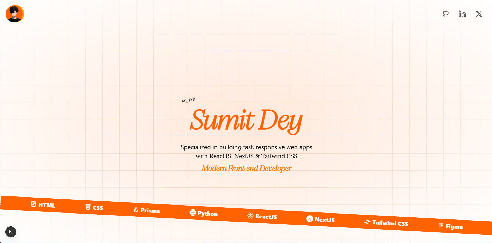

# 🧑‍💻 Sumit Dey — Developer Portfolio

Welcome to my personal developer portfolio built using **Next.js** and **Tailwind CSS**.

This website is a reflection of my journey as a **Modern Front-End Developer** — showcasing my skills, tools I use, and the projects I’ve worked on.

## 📸 Preview

Here’s a quick glimpse



> Specialized in building fast, responsive web apps with **ReactJS**, **NextJS**, and **Tailwind CSS**.

---

## 🚀 Tech Stack

* ⚛️ **Next.js** – App directory and SSR
* 🎨 **Tailwind CSS** – Utility-first styling
* 🟧 **TypeScript**
* 🔶 **Prisma** (for backend/data access)
* ✏️ **Figma** – for UI/UX design

## 📦 Installation

To run this project locally:

```bash
git clone https://github.com/sumit-dey-69/portfolio-101.git
cd portfolio-101
```

```bash
npm install
# or
yarn install
# or
pnpm install
# or
bun install
```

```bash
npm run dev
# or
yarn dev
# or
pnpm dev
# or
bun dev
```

Then visit: [http://localhost:3000](http://localhost:3000)

---

## 📁 Folder Structure

```
.
├── app/                 # Pages using Next.js app directory
├── components/          # Reusable UI components
├── public/              # Static files (images, icons, etc.)
├── styles/              # Global and component-specific styles
├── tailwind.config.js   # Tailwind CSS configuration
└── ...
```

---

## ✨ Features

* Smooth and responsive UI
* Modern grid background animation
* Social links: GitHub, LinkedIn, Twitter
* Technologies displayed with badges
* Clean typography and layout
* Optimized for performance

---

## 📬 Contact

If you’d like to connect or collaborate:

* GitHub: [@sumit-dey-69](https://github.com/sumit-dey-69)
* LinkedIn: [Sumit Dey](https://www.linkedin.com/in/sumit-dey-640700243/)
* Email: [sumitdey.dev@gmail.com](mailto:sumitdey.dev@gmail.com)

---

## 📄 License

**UNLICENSED — All Rights Reserved**

This source code is the intellectual property of the copyright holder.
You are **NOT permitted** to:

* Copy, modify, or distribute this code, in whole or in part.
* Use this code in any commercial or non-commercial project.
* Host this code or its derivatives on any platform.

> Any unauthorized use is strictly prohibited.

For permissions or inquiries, contact: [sumitdey.dev@gmail.com](mailto:sumitdey.dev@gmail.com)

---

## ⭐ Acknowledgements

* Thanks to the open-source ecosystem
* Inspired by modern developer portfolio trends

---
